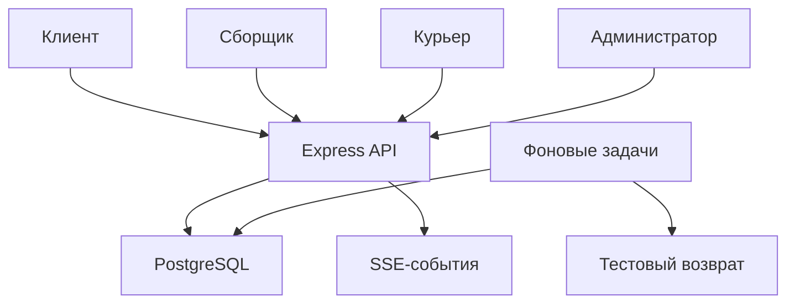
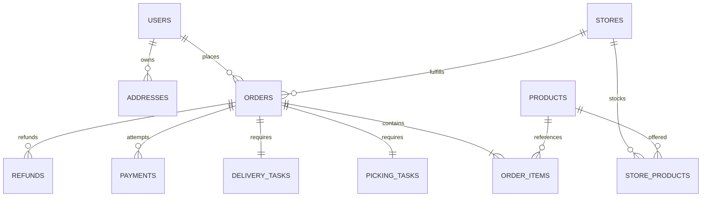
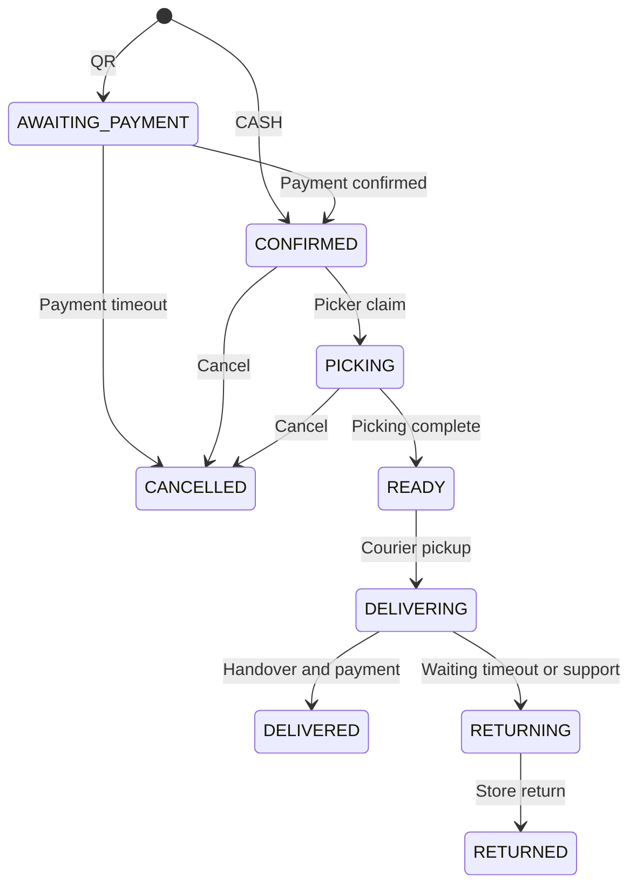

# Архитектура Бекбекей

Этот документ — для разработчика, который впервые открывает проект. Он объясняет, почему всё
устроено именно так, а не просто перечисляет файлы. Если после прочтения что-то осталось
непонятным — это повод дополнить документ, а не молча разбираться самому.

## Главная идея одним абзацем

Это **модульный монолит**: один процесс на TypeScript + Express 5, одна база PostgreSQL. Нет
очередей, нет Redis, нет микросервисов — для нагрузки MVP они не нужны, а их отсутствие резко
упрощает отладку. Фоновые задачи (таймеры оплаты, ожидание клиента) крутятся в том же процессе и
используют ту же базу как очередь.

## Почему в коде нет ORM — и это не ошибка

Если открыть любой файл в `src/modules/`, там везде встретится что-то вроде:

```ts
const items = (await tx.query('SELECT * FROM order_items WHERE order_id=$1', [id])).rows;
```

Это SQL прямо внутри обработчика запроса — и так задумано, а не забыли обернуть. В раннем
предложении проекта была Prisma, от неё осознанно отказались в пользу прямого драйвера `pg`
(`src/db.ts`). Причины:

- Транзакции и блокировки (`FOR UPDATE`, `SAVEPOINT`) видны прямо в коде, а не прячутся за
  абстракцией ORM — для этого проекта с его гонками за остатки это критично (см. раздел
  «Конкурентность» ниже).
- Не нужна генерация клиента при каждом изменении схемы.
- Тесты гоняют тот же SQL и на настоящем PostgreSQL, и на PGlite (embedded Postgres в WASM) —
  ORM с таким встроенным движком дружит не всегда.

**Это касается всего прикладного кода**, не только «служебных» мест: `catalog.ts`, `orders.ts`,
`fulfillment.ts`, `admin.ts` — везде `tx.query(...)` / `db.query(...)` напрямую. Если видишь SQL
внутри `r.post(...)` или `r.get(...)` — это нормальная часть API, а не обход каких-то правил.

**Когда SQL — это НЕ часть API.** В `src/scripts/` (`migrate.ts`, `seed.ts`, `bootstrap.ts`,
`seed-catalog.ts`) скрипты подключаются к базе напрямую, **минуя Express-сервер целиком** — ни
один HTTP-запрос не отправляется, валидация тела запроса (Zod) не проходит. Это осознанный выбор
только для разовых операций: накатить миграцию, насыпать демо-данные, создать первого
администратора (которого иначе некому создать — через API сотрудника создаёт только уже
существующий ADMIN). Любая логика, которую должен пройти обычный пользователь или сотрудник,
обязана идти через `src/app.ts` → модуль → SQL, а не в обход через такой скрипт.

## Как всё работает (компоненты системы)



- Все четыре роли (клиент, сборщик, курьер, администратор) ходят в **один и тот же** API —
  разница только в правах (`roles('ADMIN')` и т.п. на уровне маршрута).
- `Worker` — это не отдельный сервис, а таймер внутри того же процесса (`src/worker.ts`),
  который каждые 2 секунды проверяет таблицу `jobs` в той же базе.
- `SSE` — это push-уведомления через Server-Sent Events, а не WebSocket. Клиент может
  переподключиться и перечитать события заново — доставка не гарантирована на 100%, поэтому
  после реконнекта фронт обязан перечитать актуальное состояние через обычный GET, а не
  полагаться только на поток.
- Несколько инстансов API можно запускать параллельно — они не хранят состояние в памяти
  процесса (кроме rate-limit'а, см. ниже) и используют блокировки базы, чтобы не брать одно и то
  же задание дважды.

**Ограничение:** rate-limit запросов сейчас хранится в памяти процесса. На одном инстансе это
работает, но при масштабировании на несколько инстансов его нужно вынести в общее хранилище
(например, Redis) — иначе лимит будет считаться отдельно на каждом инстансе.

## Где что лежит

| Путь                         | Что внутри                                                            | Пример                                              |
| ---------------------------- | --------------------------------------------------------------------- | --------------------------------------------------- |
| `src/app.ts`                 | Middleware, роуты, обработка ошибок, Swagger, статика админки         | Тут собираются все модули в одно Express-приложение |
| `src/server.ts`              | Точка входа: подключение к базе, запуск, graceful shutdown            | `npm run dev` запускает именно его                  |
| `src/db.ts`                  | Тонкая обёртка над `pg`: `query()` и `transaction()`                  | Больше здесь ничего — это не ORM                    |
| `src/core.ts`                | Общие вещи: ошибки (`AppError`), валидация, хеши паролей/OTP, конфиг  | `assert(condition, 404, 'NOT_FOUND', '...')`        |
| `src/modules/auth.ts`        | OTP-вход клиента, вход сотрудника по паролю, сессии, права            | `authentication()`, `roles('ADMIN')`                |
| `src/modules/catalog.ts`     | Магазины, каталог, поиск, адреса клиента, избранное                   |                                                     |
| `src/modules/orders.ts`      | Корзина, расчёт стоимости, оформление, отмена, резерв остатков        |                                                     |
| `src/modules/fulfillment.ts` | Сборка заказа, замена товара, доставка, смены курьера, заработок      |                                                     |
| `src/modules/payments.ts`    | Тестовые QR-платежи, подпись webhook, защита от повторов              |                                                     |
| `src/modules/admin.ts`       | CRUD для админки (товары, магазины, сотрудники…), аудит-лог           |                                                     |
| `src/modules/support.ts`     | Обращения в поддержку и переписка                                     |                                                     |
| `src/modules/events.ts`      | Поток SSE-событий с проверкой, кому что видно                         |                                                     |
| `src/worker.ts`              | Фоновые задачи: просрочка оплаты, ожидание клиента, тестовые возвраты | Крутится в том же процессе, не отдельный сервис     |
| `src/scripts/`               | Разовые операции в обход API: миграции, сид-данные, бутстрап админа   | См. раздел про ORM выше — это другой режим работы   |
| `migrations/`                | Пронумерованные SQL-файлы схемы базы                                  | `001_initial.sql`                                   |
| `public/`                    | Админ-панель (чистый HTML/CSS/JS, без сборки)                         |                                                     |
| `tests/`                     | Интеграционные тесты через настоящий HTTP и настоящие SQL-транзакции  |                                                     |

Если модуль разрастётся, его можно разбить на `routes` / `schemas` / `service` / `repository` —
но только когда это реально понадобится. Пустые прослойки, которые просто перекладывают вызов
дальше, в этом проекте специально не заводятся: в MVP-масштабе они только мешают читать код.

## Модель данных



Полная схема со всеми колонками — в `migrations/001_initial.sql`. Три вещи, которые стоит понять
до того, как трогать заказы или остатки:

**1. Остаток и резерв — это два разных числа.**

- `store_products.stock` — физический остаток на складе магазина.
- `store_products.reserved` — сколько из этого остатка занято активными заказами.
- Реально доступно для продажи: `stock - reserved`.
- При выдаче заказа курьеру `stock` и `reserved` уменьшаются **одновременно**.
- При отмене до выдачи освобождается только `reserved` (товар физически никуда не делся).
- При подтверждённом возврате в магазин `stock` пополняется заново.

Отдельной таблицы «резервов» нет специально — баланс всегда можно проверить прямо в
`store_products`, без join'ов.

**2. Снимки (snapshots) защищают историю заказа от будущих изменений каталога.**

Поля вида `name_snapshot`, `unit_price`, `address_snapshot`, `pricing_snapshot` в `order_items` и
`orders` — это копии данных на момент покупки. Если завтра магазин переименует товар или поменяет
цену, уже оформленный заказ не должен измениться задним числом — для этого и нужны снимки.

**3. У пользователя ровно одна роль.**

`users.role` — это `CUSTOMER` / `PICKER` / `COURIER` / `ADMIN`, и только одна на аккаунт. Роль
назначает администратор при создании сотрудника; экран «выберите роль» в интерфейсе — это просто
выбор, какой UI показать, а не смена прав. `staff_stores` ограничивает сотрудника конкретными
магазинами. Если когда-нибудь понадобятся мульти-роли (один человек — и сборщик, и курьер) — это
отдельная таблица `user_roles`, а не переделка `users.role`.

## Жизненный цикл заказа



Заметки, которые не видны из самой диаграммы:

- Курьер может **взять** заказ ещё до того, как сборка завершена, но **забрать** физически — только
  когда статус дошёл до `READY`.
- Статус оплаты (`UNPAID` / `PAID` / `REFUND_PENDING` / `REFUNDED`) хранится **отдельно** от
  статуса заказа (`orders.status`) — это две независимые колонки, не путать их.
- Частичный возврат не меняет статус оплаты на `REFUND_PENDING` для всей суммы — он просто
  добавляет запись в `refunds`, а `payment_status` остаётся как было, если осталась неоплаченная
  часть.

## Конкурентность: как не словить гонку данных

Все правила ниже — не абстрактная теория, а конкретные блокировки в коде. Если меняешь логику
заказов, остатков или назначений — сверься со списком, прежде чем менять порядок запросов.

| №   | Что защищаем                                                        | Как                                                                       | Зачем именно так                                                                                                                      |
| --- | ------------------------------------------------------------------- | ------------------------------------------------------------------------- | ------------------------------------------------------------------------------------------------------------------------------------- |
| 1   | Один клиент — одна первая бесплатная доставка, один idempotency key | `SELECT ... FOR NO KEY UPDATE` на строку пользователя при создании заказа | `NO KEY` специально выбран слабее обычного `FOR UPDATE`: он не блокирует параллельную вставку событий/истории этого же пользователя   |
| 2   | Остатки товара (включая подарок и замену)                           | Блокируются **по отсортированному** `product_id`                          | Если не сортировать — два параллельных заказа могут блокировать строки в разном порядке и словить deadlock                            |
| 3   | Один промокод не используют дважды одновременно                     | Блокировка перед инкрементом счётчика использований                       | Без блокировки два параллельных заказа могут оба увидеть «лимит не исчерпан»                                                          |
| 4   | Переходы статуса заказа                                             | Блокировка строки заказа на время перехода                                | Сборщик/курьер получает задание только если заказ в нужном статусе и ещё ничей                                                        |
| 5   | Один курьер — одно активное задание за раз                          | Блокировка строки курьера при назначении и при закрытии смены             | Не даёт взять второй заказ, пока не закрыт первый                                                                                     |
| 6   | Повторный webhook от платёжного провайдера                          | `payment_events` с уникальным ключом события + блокировка заказа          | Банк может прислать один и тот же webhook дважды — это должно быть безопасно                                                          |
| 7   | Повторное начисление курьеру за один заказ                          | Первичный ключ `courier_earnings.order_id`                                | Даже если ручка вызовется дважды, заработок не удвоится                                                                               |
| 8   | Воркер не берёт чужое задание                                       | `FOR UPDATE SKIP LOCKED` при выборке из `jobs`                            | При ошибке откат идёт только до `SAVEPOINT`, счётчик попыток и текст ошибки сохраняются, а не теряются вместе с остальной транзакцией |

Два правила, которые легко нарушить случайно:

- **Никогда** не делай «прочитать остаток → отдельно записать новое значение» вне транзакции —
  между чтением и записью кто-то другой успеет изменить то же самое.
- Не меняй порядок блокировок (например, сначала блокировать заказ, а потом остатки, вместо
  наоборот), не проверив существующие конкурентные тесты в `tests/`.

## Что здесь реальное, а что — имитация

Это главное, что нужно понимать перед тем, как показывать проект заказчику или тестировать
«как в проде»:

| Что                  | Статус                      | Подробности                                                                                                                                      |
| -------------------- | --------------------------- | ------------------------------------------------------------------------------------------------------------------------------------------------ |
| SMS с кодом входа    | **Имитация**                | Код не уходит на телефон, пишется в лог сервера и виден в админке на вкладке «Коды входа» (`GET /api/v1/admin/otp-codes`, только вне production) |
| QR-оплата и возвраты | **Имитация**                | `qrPayload` вида `bekbekei-test://...` — не настоящий банковский QR; оплата подтверждается вручную через админку или тестовый webhook            |
| Фискализация (чеки)  | **Не реализована**          | Нужна для реального запуска в КР, в коде вообще отсутствует                                                                                      |
| Push-уведомления     | **Нет**, вместо них SSE     | SSE работает, только пока открыто приложение; не гарантированная доставка                                                                        |
| Геопоиск адреса      | Делает **фронтенд**         | Бэкенд только сохраняет координаты и проверяет зону доставки — ключ от геопровайдера нужен на фронте, не здесь                                   |
| Изображения товаров  | Только готовые HTTPS-ссылки | Загрузки файлов и объектного хранилища нет                                                                                                       |

Запуск с `NODE_ENV=production` **намеренно запрещён** в `src/core.ts` — приложение откажется
стартовать, пока хотя бы SMS и платежи остаются имитацией. Это защита от случайного продакшн-
деплоя с тестовыми адаптерами.

Если подключаешь настоящий платёжный провайдер: вызов банка для возврата должен идти **вне**
длинной SQL-транзакции — сначала зафиксировать задание и ключ идемпотентности, вызвать
провайдера, потом сохранить результат отдельным запросом. Текущая имитация делает всё внутри
одной транзакции только потому, что сетевого вызова на самом деле нет.

## Развёртывание и токены

- Миграции — отдельная команда (`npm run migrate`), запускается **до** старта приложения, не на
  каждом старте автоматически.
- Пул подключений к базе — максимум 10 соединений; у каждого SQL-запроса таймаут 15 секунд.
- Доступ к админке проверяется на уровне API (`roles('ADMIN')`), а не скрытием кнопок в браузере
  — спрятанная в интерфейсе кнопка никого не защищает, если endpoint доступен напрямую.
- Access-токен админки живёт только в памяти страницы. Refresh-токен дополнительно лежит в
  `sessionStorage` вкладки — это значит, что он переживает `F5`, но стирается при выходе и при
  закрытии вкладки. В `localStorage` или URL токены не попадают никогда — так их не сможет
  прочитать скрипт, вставленный через XSS и переживший закрытие вкладки.

Перед реальным запуском дополнительно нужны: HTTPS, резервное копирование базы, мониторинг и
оповещения (сейчас их нет вообще — логи только в stdout процесса), политика хранения событий и
персональных данных, согласованные тарифы и юридические тексты. Техническая админ-панель не
заменяет мобильное приложение — она и не задумывалась как клиентский продукт.
