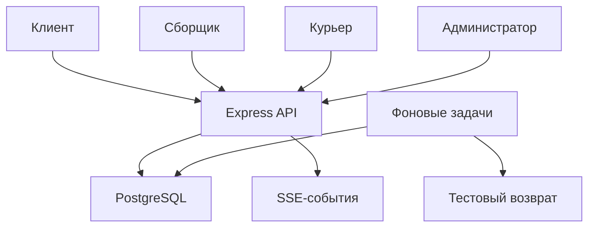
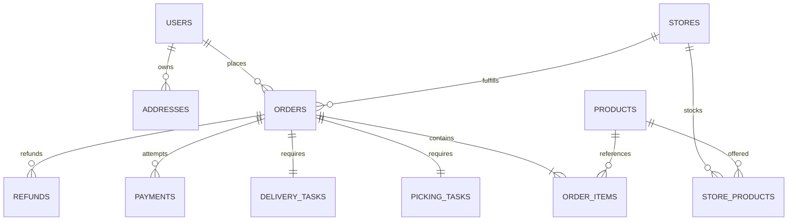
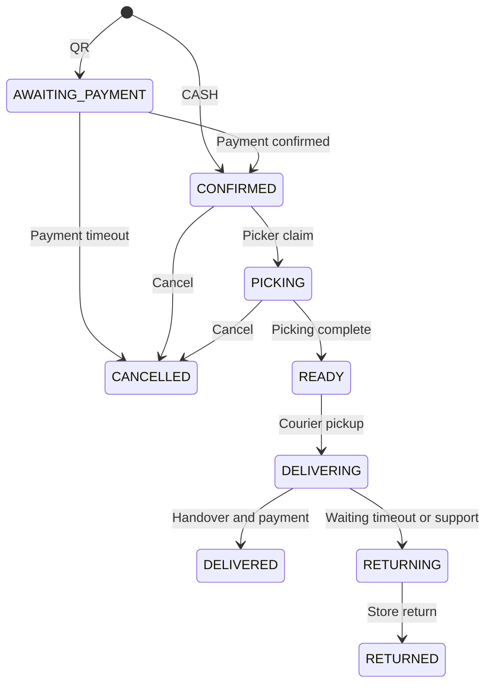

# Архитектура Бекбекей

## Основание

Макет содержит вход клиента по SMS, магазин и каталог, карточки товаров, корзину, адреса, наличные/QR, историю, статусы заказа, сборщика, курьера, смены, ожидание клиента, возврат и поддержку. Экран админки отсутствует; добавлена техническая панель для управления этим процессом.

Выбран модульный монолит: TypeScript + Express 5 + PostgreSQL. Каждый модуль имеет маршруты и обработчики; бизнес-функции заказа выделены для повторного использования сборкой, оплатой и фоновыми задачами. SQL-запросы параметризованы. ORM Prisma из предварительного предложения заменена прямым драйвером `pg`: схема и транзакции здесь видны явно, не требуют генерации клиента и одинаково проверяются PostgreSQL/PGlite.

## Компоненты

API и обработчик задач находятся в одном процессе, но задачи долговечны. PostgreSQL одновременно хранит бизнес-данные, события и очередь. Redis для первоначального масштаба не требуется. Дополнительные экземпляры используют блокировки базы для заданий, остатков и назначений. Ограничение частоты запросов в текущей версии хранится в памяти процесса; при масштабировании его нужно вынести в общее хранилище.

## Структура

| Путь | Ответственность |
|---|---|
| `src/app.ts` | Middleware, маршруты, обработка ошибок, Swagger, админка |
| `src/server.ts` | Запуск, подключение к базе, остановка |
| `src/db.ts` | SQL-интерфейс и транзакции PostgreSQL |
| `src/core.ts` | Ошибки, валидация, криптография, конфигурация |
| `src/modules/auth.ts` | OTP, вход сотрудников, сеансы и права |
| `src/modules/catalog.ts` | Магазины, каталог, адреса, профиль, избранное |
| `src/modules/orders.ts` | Корзина, расчёт, оформление, отмена, резерв, перерасчёт |
| `src/modules/fulfillment.ts` | Сборка, замены, доставка, смены и заработок |
| `src/modules/payments.ts` | Тестовые платежи, подпись и дедупликация событий |
| `src/modules/admin.ts` | Управление и аудит |
| `src/modules/support.ts` | Обращения и сообщения |
| `src/modules/events.ts` | Поток событий с проверкой видимости |
| `src/worker.ts` | Истечение оплаты, ожидание клиента, тестовые возвраты |
| `migrations/` | Версионируемая схема базы |
| `public/` | Простая административная панель |
| `tests/` | Проверки через HTTP и настоящие SQL-транзакции |

Для расширения крупного модуля его можно разнести на `routes`, `schemas`, `service`, `repository`, сохранив границы. Пустые слои, которые только передают вызов дальше, в MVP не создаются.

## Модель данных

Полная схема в `migrations/001_initial.sql`. Резерв хранится как `store_products.reserved` и `order_items.reserved_quantity`; это позволяет проверить баланс без отдельной таблицы резервов. Снимки `name_snapshot`, `unit_price`, `address_snapshot`, `pricing_snapshot` сохраняют состояние покупки независимо от последующих изменений каталога.

`stock` — физический остаток магазина; `reserved` — часть этого остатка для активных заказов. Доступно `stock - reserved`. При передаче курьеру одновременно уменьшаются `stock` и `reserved`. При отмене до передачи освобождается только резерв. При подтверждённом возврате пополняется физический остаток.

`users.role` содержит одну роль на аккаунт. Администратор выдаёт роль при создании сотрудника; экран «Выберите роль» лишь выбирает интерфейс. `staff_stores` ограничивает доступ магазинами. Мульти-роли можно добавить отдельной таблицей, если это станет бизнес-требованием.

## Состояния

Курьер назначается до завершения сборки, но забрать заказ может только в `READY`. Статус оплаты хранится отдельно: `UNPAID`, `PAID`, `REFUND_PENDING`, `REFUNDED`. Частичный возврат не снимает с оставшейся суммы статус `PAID`; суммы возвратов отражаются в `refunds`.

## Конкурентность

1. Создание заказа блокирует пользователя через `FOR NO KEY UPDATE`, чтобы две покупки не получили одну первую бесплатную доставку и один idempotency key. Такая блокировка допускает `KEY SHARE` для внешних ключей и не блокирует вставку событий/истории этого пользователя.
2. Все затрагиваемые остатки блокируются по сортированному `product_id`, включая подарок и замену.
3. Промокод блокируется перед увеличением счётчика.
4. Переходы состояний блокируют строку заказа. Сборщик/курьер получают задание только при допустимом состоянии и отсутствии владельца.
5. Курьер дополнительно блокирует свою строку пользователя при назначении и завершении смены.
6. Запись оплаты обрабатывается под блокировкой заказа; `payment_events` защищает от повторного события.
7. Начисление имеет первичный ключ `order_id`; повторное вручение не удваивает заработок.
8. Воркер выбирает задания через `FOR UPDATE SKIP LOCKED`. Ошибка откатывает бизнес-часть к SAVEPOINT, сохраняя счётчик попыток и ошибку задачи.

Не используйте «прочитать остаток, затем отдельно записать» вне транзакции. Не меняйте порядок блокировок без проверки конкурентных сценариев.

## Границы интеграций

Сейчас внешних запросов при выполнении транзакций нет. Для настоящего SMS нужен адаптер вместо записи кода в лог. Для банка нужны создание платежа, идентификатор провайдера, его формат подписанного webhook, запрос фактического статуса и идемпотентный refund.

При подключении реального refund вызов банка следует выполнять **вне** длинной SQL-транзакции: сначала долговечно зафиксировать задание и ключ идемпотентности, вызвать провайдера, затем сохранить результат. Текущая имитация выполняется внутри транзакции, потому что сетевого вызова нет.

Таймеры в базе восстанавливаются после перезапуска. SSE не является гарантированной доставкой push: клиент после переподключения перечитывает данные. Настоящие push, картографический поиск, расчёт маршрута и объектное хранилище подключаются отдельными адаптерами.

## Развёртывание

Миграции — отдельная команда, перед запуском приложения. Подключение к базе выполняется пулом до 10 соединений; SQL имеет timeout 15 секунд. Доступ к админке проверяется на API, а не только скрытием элементов в браузере. Токены админки хранятся в памяти страницы и очищаются при выходе/перезагрузке.

Перед реальным выпуском нужны HTTPS, резервное копирование, мониторинг/оповещения, политика хранения событий и персональных данных, реальные адаптеры и утверждённые тарифы/условия. Техническая админка не является мобильным клиентом из дизайна.
